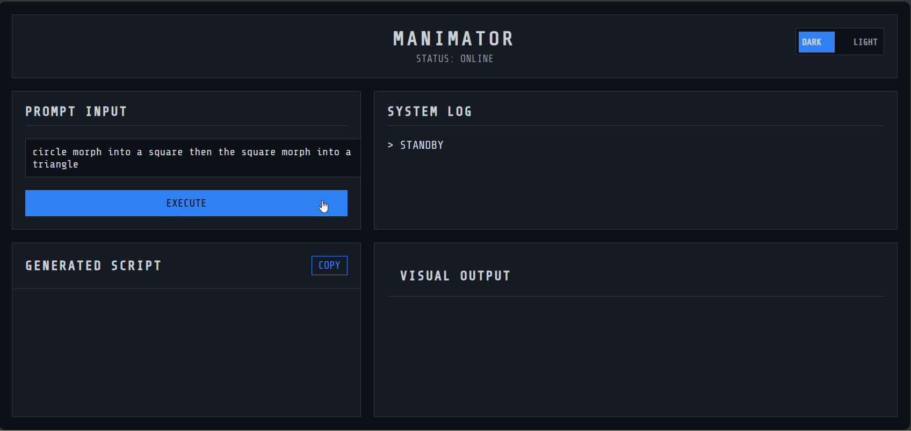

# Manim AI Generator

  
  
  
  

An AI-powered web application that leverages Google's Gemini model to generate and render Manim animations from a simple text prompt. The application features a robust Python backend, secure code execution via Docker, and a polished, futuristic "spy-tech" UI with light/dark modes.

---

## ✨ Demo



---

## 🔧 Core Features

- 🔮 **AI-Powered Animation**: Enter a conceptual prompt, and the Gemini AI will generate the Python code required to animate it.
- 🖥️ **Futuristic UI**: A custom-built, responsive "spy-tech" dashboard interface that is both stylish and functional.
- 🌗 **Light/Dark Mode**: A sleek, animated toggle switch to move between light and dark themes, with the user's preference saved locally.
- 🛡️ **Secure Sandboxed Execution**: Untrusted, AI-generated code is executed in an isolated Docker container to protect the host system.
- ✅ **Robust Error Handling**: The backend can intelligently distinguish between AI failures, Manim code crashes, and "do-nothing" scripts, providing clear feedback to the user.
- 📝 **Syntax Highlighting**: The generated code is beautifully highlighted for readability.

---

## 🛠️ Tech Stack

- **Backend**: Python, FastAPI, Uvicorn  
- **AI**: Google Gemini API (`google-generativeai`)  
- **Execution Environment**: Docker, Manim Community  
- **Frontend**: HTML5, CSS3, Vanilla JavaScript  
- **Dependencies**: `python-dotenv`, `docker`

---

## 🚀 Setup and Installation

Follow these steps to get the project running on your local machine.

<details>
<summary><strong>Click to expand detailed setup instructions</strong></summary>

### 1. Prerequisites

- Python (version 3.11+ recommended)  
- Docker Desktop (must be running)  
- Git

---

### 2. Clone the Repository

```bash
git clone https://github.com/YourUsername/manim-ai-generator.git
cd manim-ai-generator
```

> Replace `YourUsername` with your actual GitHub username.

---

### 3. API Key Setup

> **This is the most critical step for security.**

Create a new file in the root of the project directory named `.env`.

Open the `.env` file and add your Google Gemini API key in the following format:

```env
GEMINI_API_KEY=...Your...Key...Here...
```

> The `.gitignore` file is already configured to prevent this file from ever being uploaded to GitHub.

---

### 4. Create a Virtual Environment and Install Dependencies

It's highly recommended to use a virtual environment.

```bash
# Create the virtual environment
python -m venv venv

# Activate it
# On Windows:
venv\Scripts\activate

# On macOS/Linux:
source venv/bin/activate

# Install the required Python packages
pip install -r requirements.txt
```

> You will need to create the `requirements.txt` file. See the section below.

---

### 5. Build the Manim Docker Image

This step creates the sandboxed environment for rendering. The first time you run this, it may take a long time (10–20+ minutes) to download and install all dependencies. Subsequent builds will be much faster.

```bash
docker build -t manim-runner .
```

---

### 6. Run the Application

Start the FastAPI server.

```bash
uvicorn main:app --reload
```

The server will be running, and you can access the application in your browser:

```
http://127.0.0.1:8000
```

</details>

---

## ⚙️ Creating the `requirements.txt` File

After activating your virtual environment and installing the packages with `pip` during development, run the following command in your terminal to create the `requirements.txt` file for others to use:

```bash
pip freeze > requirements.txt
```

---

## 🧪 Usage

Once the server is running, open your web browser and navigate to:

```
http://127.0.0.1:8000
```

Type a concept for an animation into the prompt input box (e.g., `a circle that moves from left to right`).

Click the **"EXECUTE"** button and watch the magic happen!

---

## 🗺️ Roadmap: Future Improvements

- 🔁 **Self-Correction Loop**: When a Manim error is detected, automatically send the buggy code and the error message back to the AI to attempt a fix.
- 🎚️ **Parameter Controls**: Allow the user to control parameters like `run_time`, `color`, `font_size` from the UI.
- 🕘 **History Panel**: Add a panel that shows a history of previous prompts for the current session.

---

## 📄 License

This project is distributed under the **MIT License**.